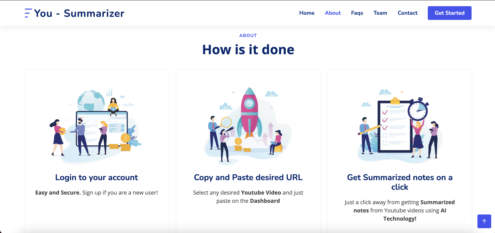
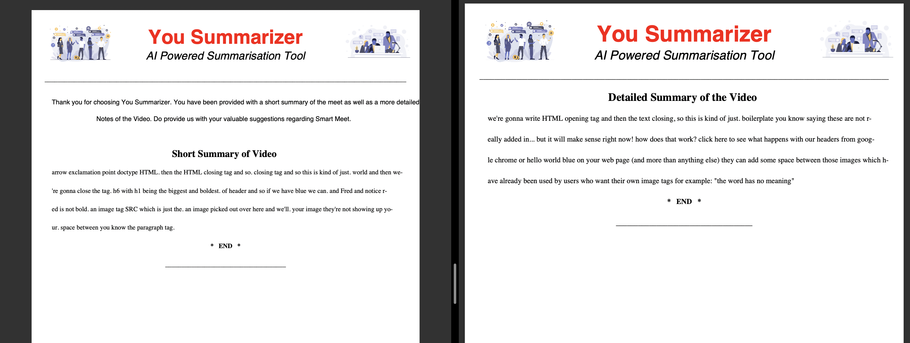

# Automated Video Summarizer
> Automatic video summarization and notes generation by just providing the url of any youtube video.
<!-- > Live demo [_here_](https://www.example.com). If you have the project hosted somewhere, include the link here. -->

## Table of Contents
* [General Info](#general-information)
* [Technologies Used](#technologies-used)
* [Features](#features)
* [Screenshots](#screenshots)
* [Setup](#setup)
* [Usage](#usage)
* [Project Status](#project-status)
* [Contact](#contact)
<!-- * [License](#license) -->

## General Information
- Due to Covid-19 pandemic, Online learning has boosted alot and Youtube is a major part of it, as most students refer to youtube videos in order to learn and study various topics
- So it becomes tedious to stop the video in order to take notes of a particular topic, and repeating these steps becomes time consuming and tiring, To tackle this problem, this project is implemented.
- User just needs to provide the url of any youtube video and automated notes of the same will me made available to user in pdf format
- Both Extractive as well as abstractive summaries are provided to user.
<!-- You don't have to answer all the questions - just the ones relevant to your project. -->

## Technologies Used
- Python - (flask_cors, sklearn, torch, pytorch_pretrained_bert, fpdf, transformers, youtube_transcript_api, nltk, flask_bcrypt, pymongo)
- HTML/CSS/Bootstrap
- MongoDB

## Features
Below is the list of features available in the project:
- User Database in order to store newly generated as well as old pdfs
- AI Integration with backend
- Realtime fetching as well as notes preparation

## Screenshots

<!-- If you have screenshots you'd like to share, include them here. -->

## Setup
MongoDB server should be started at port 27017
All libraries present in `requirements.txt` should be downloaded

## Usage
After setup,
`python app.py` does the work.

## Project Status
Project is: _Complete_ 

## Contact
Created by [@Shriram Pareek](https://github.com/Shrirampareek888), [@Kishan Partani](https://github.com/KishanPartani),[@Tejas Pradhan](https://github.com/tejaspradhan),[@Aditya Pangaonkar](https://github.com/Adi306) and [@Balaji Padamwar](https://github.com/balaji1608) - feel free to contact us!

<!-- Optional -->
<!-- ## License -->
<!-- This project is open source and available under the [... License](). -->

<!-- You don't have to include all sections - just the one's relevant to your project -->
